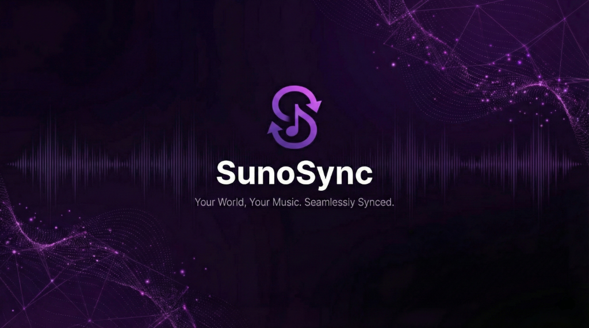

# SunoSync V3.0

**Your World, Your Music. Seamlessly Synced.**

SunoSync is the ultimate desktop ecosystem for your Suno AI music generation. It combines a powerful bulk downloader, a rich music library, a prompt vault, live radio broadcasting, and a mobile bridge into one seamless application.

**Discord Support and Community:** https://discord.gg/kZSc8sKUZR

## 🌟 Key Features

### 🎨 Modern UI Redesign
*   **Sleek Dark Theme**: A fully custom, responsive interface built with CustomTkinter.
*   **Compact Sidebar**: Optimized navigation with a sticky "Settings" footer for easy access on any screen size.
*   **Inline Controls**: Quick access to Workspaces and Playlists via inline dropdown menus.

### 📥 Smart Downloader
*   **Advanced Filtering**: Filter by Status (Liked, Public, Trash) and Type (Generations, Uploads) with a new robust Filter Bar.
*   **Bulk Downloading**: Download your entire Suno library in one click.
*   **Smart Sync**: Only downloads new songs, skipping existing files.
*   **Format Choice**: **MP3** (Compact) or **WAV** (Lossless).
*   **Metadata Embedding**: Automatically embeds Title, Artist, **Lyrics**, and Cover Art into audio tags.

### 📚 Ultimate Music Library
*   **Visual Browser**: Browse your collection with a clean, dark-themed grid.
*   **Clean Titles**: Automatically sanitizes messy raw titles into readable text.
*   **Tag System**: Organize with Like 👍, Star ⭐, and Trash 🗑️.
*   **Stats Dashboard**: View detailed analytics of your library (Top Genres, Monthly Activity, etc.).

### 🔌 Chrome Extension Integration
*   **Auto-Token Sync**: Never manually copy cookies again. The companion Chrome Extension automatically syncs your Suno session with the desktop app.

### 📻 Suno On-Air & Mobile Bridge
*   **Live Radio**: Broadcast your library as a live web radio station to share with friends.
*   **Mobile Bridge**: Scan a QR code to stream your library directly to your phone browser.

### 🔐 Prompt Vault
*   **Save Your Prompts**: Never lose a great prompt again. Save and organize your best prompts.
*   **One-Click Copy**: Quickly copy prompts to clipboard for reuse in Suno.

## 🚀 Getting Started

1.  **Download**: Get the latest `SunoSync.exe`.
2.  **Install VLC**: Ensure [VLC Media Player](https://www.videolan.org/) is installed (required for audio engine).
3.  **Run**: Double-click `SunoSync.exe`.
4.  **Connect**:
    *   **Option A (Easy)**: Install the SunoSync Chrome Extension. It will automatically detect the app and sync your token.
    *   **Option B (Manual)**: Click "Get Token", log in to Suno.com, open DevTools -> Application -> Cookies, and copy the `__client` cookie.

## � Chrome Extension (Auto-Auth)

SunoSync comes with a companion Chrome Extension that makes authentication automatic.

1.  **Open Chrome Extensions**: Go to `chrome://extensions/`.
2.  **Enable Developer Mode**: Toggle the switch in the top right.
3.  **Load Unpacked**: Click the button and select the `chrome_extension` folder inside the SunoSync directory.
4.  **Done!**: The extension will now automatically detect when SunoSync is open and sync your session token. No more copy-pasting cookies!

## 🔄 Updating SunoSync

### If you built from source (Git):
1.  Open your terminal in the `SunoSync-main` folder.
2.  Run `git pull` to get the latest code.
3.  Run `pip install -r requirements.txt` to check for new dependencies.
4.  Run `python main.py` or rebuild the EXE.

### If you use the standalone EXE:
1.  Download the new version from the release page.
2.  Replace your old `SunoSync.exe` with the new one.
3.  Your settings and database (`library_cache.json`) are safe and will be preserved.

## �🔒 Transparency

We believe in 100% transparency. SunoSync is an indie tool built with Python.
*   **Crash Shield**: Built-in error reporting (Sentry) helps us fix bugs faster.
*   **False Positives**: Some antivirus software may flag the app because it is not digitally signed by a corporation. This is normal for open-source Python tools.

## ☕ Support
---
*SunoSync is an unofficial tool and is not affiliated with Suno AI.*